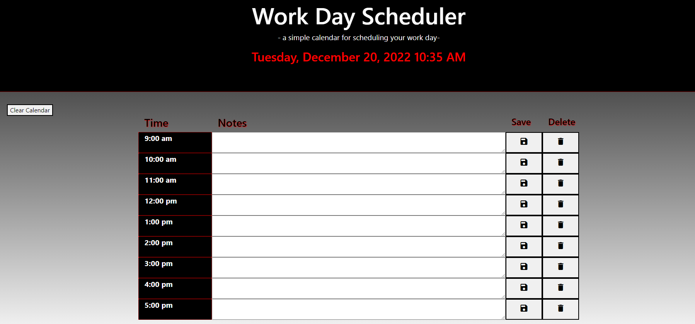

# <Work-Day-Scheduler>

## Description

Here is a daily planner that enables users to enter tasks into different timeblocks to manage their time throughout the day.

While completing this web application, I learned how to use third-party APIs more effectively.

## Usage

Click on the the timeblock you would like to type and save information in.

https://allstarcoding777.github.io/work-day-scheduler/

## License

Please refer to the license in the repo.